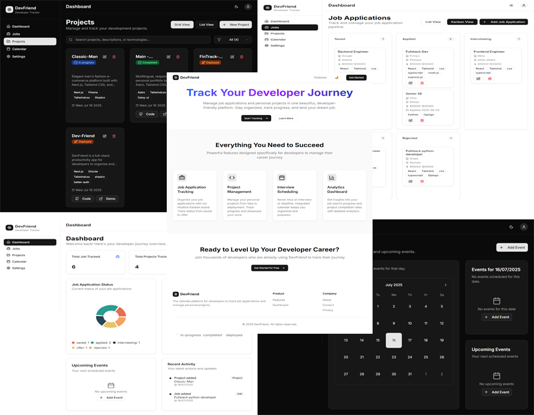

# DevFriend

DevFriend is a **full-stack productivity web app** for developers to organize their **job applications, personal projects, and important events in one place**, helping them stay focused while managing their career journey.

[DevFriend Live Link](https://devfriend-one.vercel.app)


---

## 🚀 Features

✅ **Projects Tracking**

* Add projects with title, description, status, start date, deadline, demo link, and GitHub link.
* View projects in grid or list mode.
* Update and delete project entries.

✅ **Job Applications Tracker**

* Add jobs with title, company, salary, status, deadline, link, and description.
* View jobs in list mode or Kanban mode based on user preference.
* Update and delete job entries.

✅ **Event Management**

* Add events with type, priority, title, description, and date.
* View events in a clean calendar (shadcn calendar) and upcoming events sidebar.
* Update and delete events.

✅ **Dashboard**

* Donut and bar charts summarizing job applications, projects, and events.
* Quick-access cards for summaries.

✅ **Authentication**

* Email/password authentication with Better-Auth.
* **Social sign-in with Google and GitHub.**

✅ **UI/UX**

* Clean, developer-friendly dashboard layout with sidebar navigation.
* Dark/light mode support.
* Fully responsive and mobile-friendly.

✅ **Landing Page**

* Promotional landing page with hero, call-to-action, and feature overview.

---

## 🛠 Tech Stack

* **Framework:** Next.js (App Router, API Routes)
* **Frontend:** React, Tailwind CSS, shadcn/ui
* **Backend:** Next.js API Routes, Drizzle ORM
* **Database:** PostgreSQL
* **Auth:** Better-Auth with Email, Google, and GitHub sign-in

---

## 📸 Screenshots




---

## 🚀 Getting Started

### 1️⃣ Clone the repository

```bash
git clone https://github.com/Andu-alem/devfriend.git
cd devfriend
```

### 2️⃣ Install dependencies

```bash
pnpm install
```

### 3️⃣ Set up environment variables

Create a `.env.local` file:

```env
DATABASE_URL=your_postgres_database_url
NEXTAUTH_SECRET=your_auth_secret
NEXT_PUBLIC_APP_URL=http://localhost:3000
BETTER_AUTH_URL=your_better_auth_url
BETTER_AUTH_SECRET=your_better_auth_secret
```

Ensure you also configure Google and GitHub client IDs and secrets in your Better-Auth dashboard for social login.

---

### 4️⃣ Run database migrations

```bash
pnpm drizzle push
```

### 5️⃣ Start the development server

```bash
pnpm run dev
```

Your app will be running at [http://localhost:3000](http://localhost:3000).

---

## ✅ Roadmap

* [x] Project tracking CRUD
* [x] Job application tracking CRUD
* [x] Event management with calendar view
* [x] Dashboard charts and summaries
* [x] Email/password authentication
* [x] Social sign-in with Google and GitHub
* [x] Dark/light mode and responsiveness
* [ ] AI integration for resume bullet generation (future)
* [ ] Google Calendar sync (future)

---

## 🤝 Contributing

Contributions, issues, and feature requests are welcome!

1. Fork the project.
2. Create your feature branch (`git checkout -b feature/YourFeature`).
3. Commit your changes (`git commit -m 'Add YourFeature'`).
4. Push to the branch (`git push origin feature/YourFeature`).
5. Open a pull request.

---

## 📄 License

MIT License

---

## 🌐 Live Demo

[DevFriend Live Link](https://devfriend-one.vercel.app)

---

## 📫 Contact

For questions or collaboration:

* **Email:** [Andualem](mailto:andualem.fereja12@gmail.com)

---

> **DevFriend helps developers focus on what matters while keeping their career and projects organized.**

---
